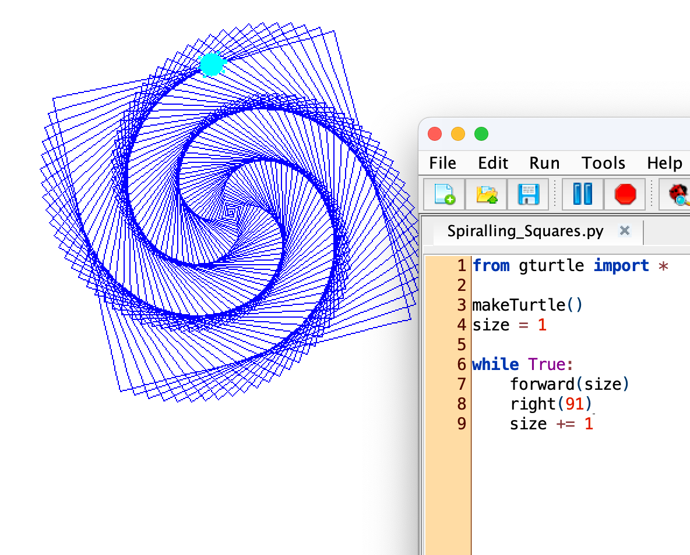
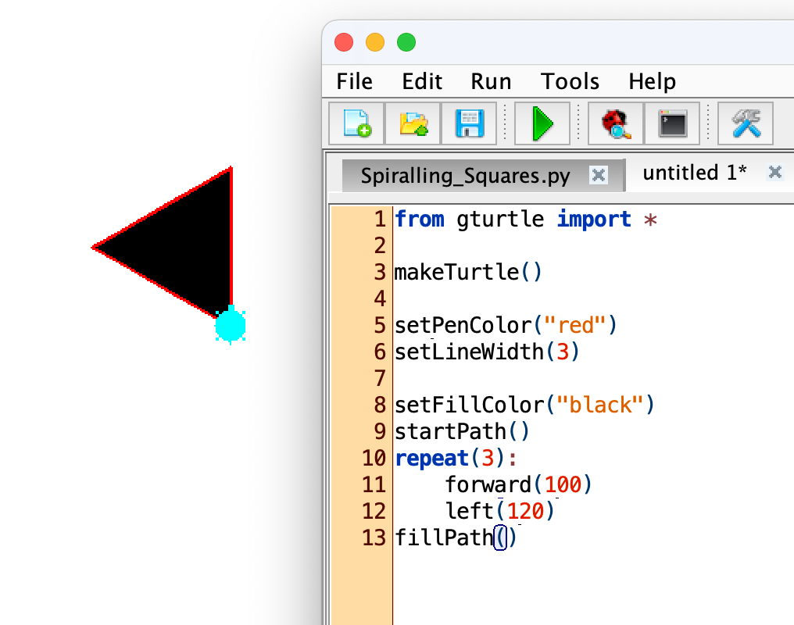
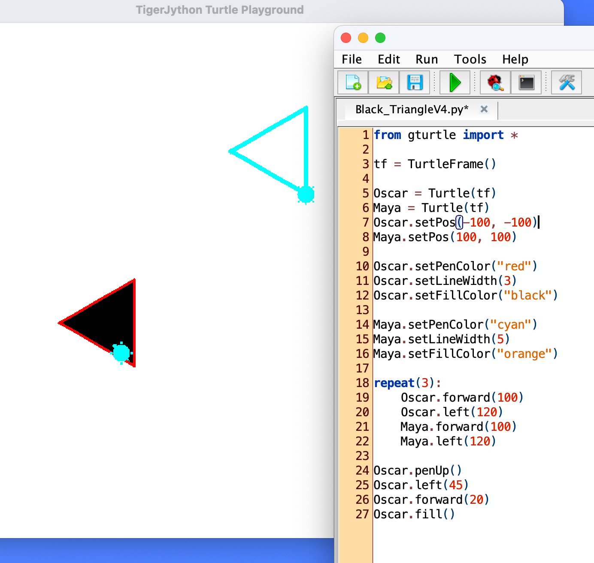

# Four examples using TigerJython's gturtle library 

## Spiralling Squares

### The code script

```Python
from gturtle import *

makeTurtle()
size = 1

while True:
    forward(size)
    right(91)
    size += 1
```

### The output


### Try out and improve your understanding
- [ ] Change the angle in the method ```right(...)```, choose different values. Predict the outcome, then run and see whether your prediction was correct.
- [ ] What does the line ```size += 1``` do to the value of the variable size?


## Black triange with red border

### The code script
```python
from gturtle import *

makeTurtle()

setPenColor("red")
setLineWidth(3)

setFillColor("black")
startPath()
repeat(3):
    forward(100)
    left(120)
fillPath()
```

### The output



### Try out and improve your understanding


## Two turtles
### The code script
```python
from gturtle import *

tf = TurtleFrame()

Oscar = Turtle(tf)
Maya = Turtle(tf)
Oscar.setPos(-100, -100)
Maya.setPos(100, 100)

Oscar.setPenColor("red")
Oscar.setLineWidth(3)
Oscar.setFillColor("black")

Maya.setPenColor("cyan")
Maya.setLineWidth(5)
Maya.setFillColor("orange")

repeat(3):
    Oscar.forward(100)
    Oscar.left(120)
    Maya.forward(100)
    Maya.left(120)

Oscar.penUp()
Oscar.left(45)
Oscar.forwa
rd(20)
Oscar.fill()
```
### The output


### Try out and improve your understanding
- [ ] Let Maya also fill out her triangle with a colour of your choice.
- [ ] Let Maya draw a square instead of the triangle.
