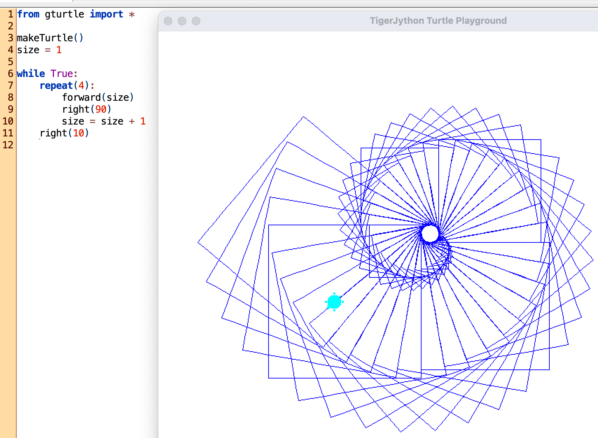
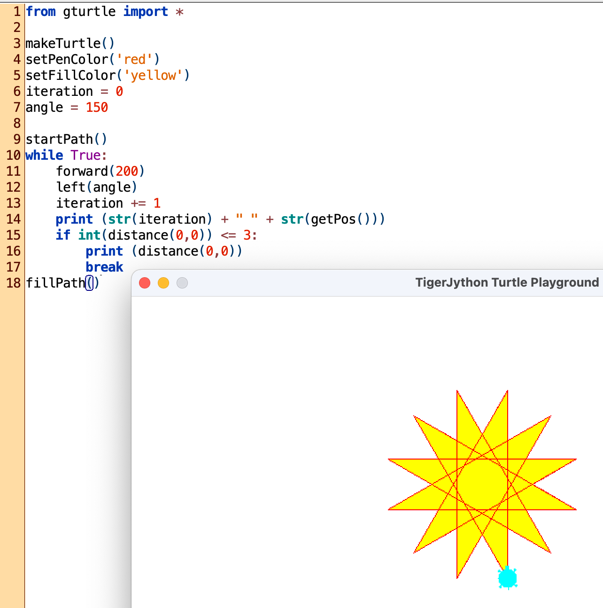
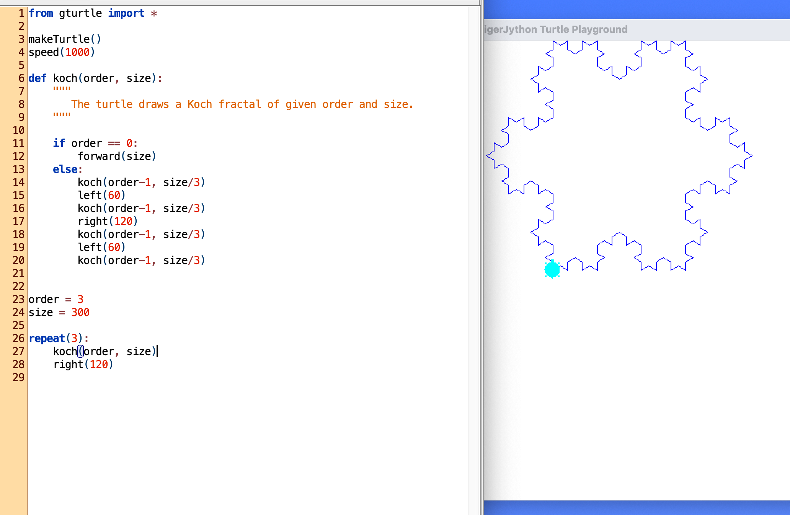
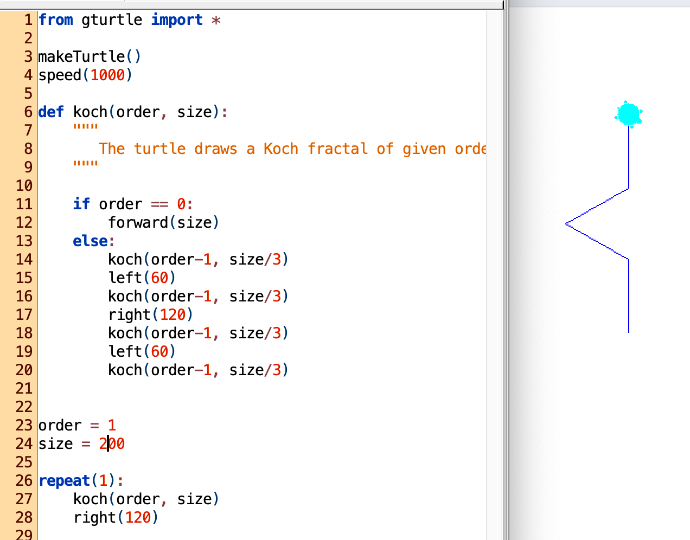

# Four examples using TigerJython's gturtle library 

## Spiralling Squares

### The code script

```Python
from gturtle import *

makeTurtle()
size = 1

while True:
    forward(size)
    right(91)
    size += 1
```

### The output


### Try out and improve your understanding
- [ ] Change the angle in the method ```right(...)```, choose different values. Predict the outcome, then run and see whether your prediction was correct.
- [ ] What does the line ```size += 1``` do to the value of the variable size?


## Black triange with red border

### The code script
```python
from gturtle import *

makeTurtle()

setPenColor("red")
setLineWidth(3)

setFillColor("black")
startPath()
repeat(3):
    forward(100)
    left(120)
fillPath()
```

### The output


## Nautilus
### The code script
```python
from gturtle import *

makeTurtle()
size = 1

while True:
    repeat(4):
        forward(size)
        right(90)
        size = size + 1
    right(10)
```

### The output


## Yellow Star
### The code script
```python
from gturtle import *

makeTurtle()
setPenColor('red')
setFillColor('yellow')
iteration = 0
angle = 150

startPath()
while True:
    forward(200)
    left(angle)
    iteration += 1
    print (str(iteration) + " " + str(getPos()))
    if int(distance(0,0)) <= 3:
        print (distance(0,0))
        break
fillPath()
```

### The output



## Koch kurve

### The code script
```python
from gturtle import *

makeTurtle()
speed(1000)

def koch(order, size):
    """
       The turtle draws a Koch fractal of given order and size.
    """
    
    if order == 0:
        forward(size)
    else:
        koch(order-1, size/3)
        left(60)
        koch(order-1, size/3)
        right(120)
        koch(order-1, size/3)
        left(60)
        koch(order-1, size/3)
    
    
order = 3
size = 300

repeat(3):
    koch(order, size)
    right(120)
```

### The output



### How does it work?


The Koch curve is an example for a recursive function. A recursive function is a function that calls itself. The function is defined in line 6 to 20, and you see four function calls of itself within the function.

In the basic case you only have one function call, in this case the variable *order* has the value one. The output for order = 1 is shown here in the image above. You see that the basic drawing consists of four lines, and three turns. This is described within the function koch with lines 14 to 20. If you would draw a straight line from the starting to the end point, you would get 3 sections of equal length.

When you increase now the order by one, *order = 2*, you will impress the same shape only 1/3 of the size on each of the four lines, replacing the original lines. Whenever you increase the order by one, you impress the same structure on an ever smaller scale on the previously drawn line.

The snow flake is ultimately created by assembling three of these fractures, turned by 120 degrees each, see lines 26 to 28.


## Two turtles

### The code script
```python
from gturtle import *

tf = TurtleFrame()

Oscar = Turtle(tf)
Maya = Turtle(tf)
Oscar.setPos(-100, -100)
Maya.setPos(100, 100)

Oscar.setPenColor("red")
Oscar.setLineWidth(3)
Oscar.setFillColor("black")

Maya.setPenColor("cyan")
Maya.setLineWidth(5)
Maya.setFillColor("orange")

repeat(3):
    Oscar.forward(100)
    Oscar.left(120)
    Maya.forward(100)
    Maya.left(120)

Oscar.penUp()
Oscar.left(45)
Oscar.forwa
rd(20)
Oscar.fill()
```
### The output


### Try out and improve your understanding
- [ ] Let Maya also fill out her triangle with a colour of your choice.
- [ ] Let Maya draw a square instead of the triangle.
