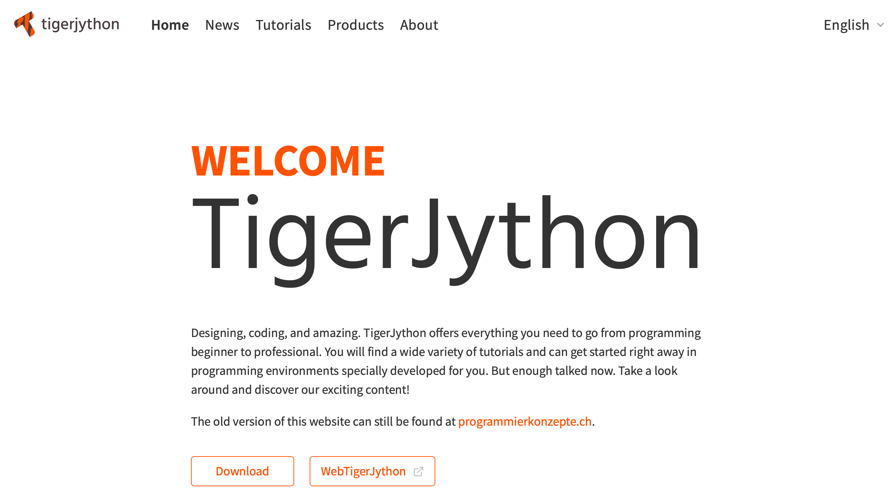

# TigerJython - Content



For this module we are using TigerJython. The website below contains a lot of materials and tools that make it easier learning to code:

- A [downloadable version](https://tigerjython.com/en/products/download) of TigerJython, this tool we will use. Please download the correct installer for your operating system. 

**ATTENTION:** When you are using TigerJython on MacOS, you need a few extra steps to get it running. Please check with your instructor before you start the program for the first time.

- An online version that runs on the web browser. The online version does not support all functions that we need and some of the scripts (programs) in the online textbook will not run or will require changes.

- An [online textbook](https://programmierkonzepte.ch/engl/), avaialble in English, French, and German. This text will be our guideline for discovering TigerJython.


This [link](https://tigerjython.com/en) brings you to the homepage or TigerJython.


### What to do today:
- [ ] Install TigerJython on your computer. If you are using a school computer, please check on the ```Netsoft``` folder under IT and download the file available on that folder.

**ATTENTION:** On the school computers you cannot install software from the internet. Only authorized software available on ```Netsoft``` can be installed.

- [ ] Familiarize yourself with TigerJython and learn the basic *edit - save - run workflow*. 
- [ ] Create your first artwork using turtle graphics with the gturtle library. You will find some examples to code in the [file](https://github.com/mikefromd/TJ_Content/blob/main/Quatre_exemples_graphiques.md) on this repository.
